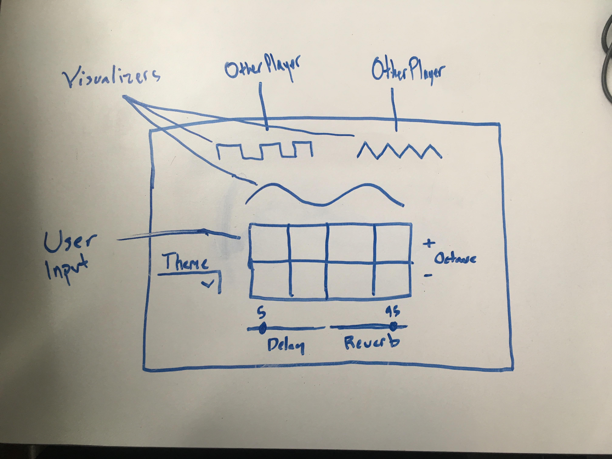

<h1>Ambient Jam</h1>

<h2>Overview</h2>

In our fourth project, we (SEI24) were asked to make a full-stack application (either MERN or Django REST with React). I wanted to create an app that allows you to make music with others! Upon entering the app's player screen, the user should be able to hear all of the sounds other users are making, and be able to add to them as well, LIVE! This is Ambient Jam

 

<a href="https://master.d1huw8oejjdm3j.amplifyapp.com/" target="_blank"><h2>Ambient Jam</h2></a>
 

<h2>Wireframe</h2>

 

<h2>Technologies Used</h2>
<ul>
<li>HTML</li>
<li>CSS</li>
<li>JavaScript</li>
<li>Django*</li>
<li>PostgreSQL*</li>
<li>Python*</li>
<li>Socket.IO</li>
<li>Express.js</li>
<li>Sass</li>
<li>React.js</li>
<li>Node.js</li>
<li>Heroku</li>
<li>GitHub</li>
<li>VS Code</li>
</ul>

* Removed from this version

 

<h2>Future Edition Additions</h2>

<ul>
<li>Lobbies</li>
<li>Synth Selesction and Editing</li>
</ul>
